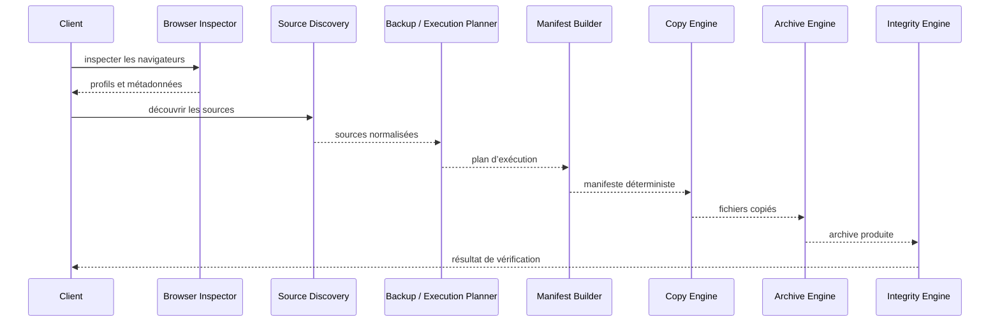
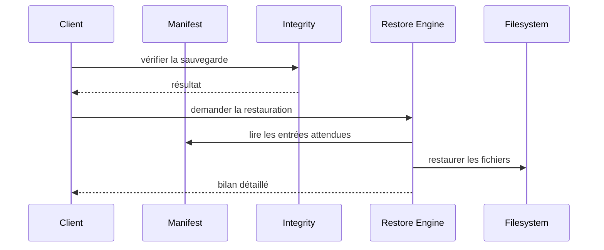

# Flux d’exécution

## Sauvegarde

## Restauration

## Invariants

- La découverte ne copie aucun fichier.
- La planification ne modifie aucune source.
- Le Manifest Builder ne réalise aucune copie.
- Le Copy Engine applique un plan déjà validé.
- La restauration ne dépend pas d’une nouvelle inspection du navigateur source.
- Une erreur locale est isolée et reportée lorsque la poursuite reste sûre.
