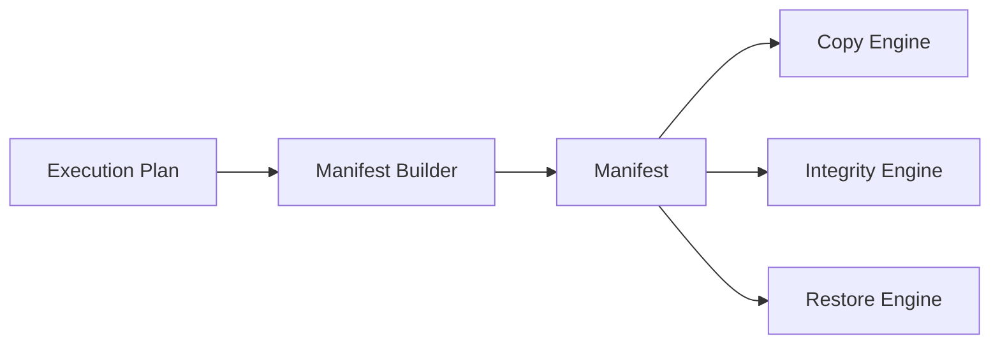

# Manifeste de sauvegarde

Le manifeste est le contrat persistant entre la planification et les moteurs d’exécution. Il décrit ce qui doit être traité sans demander au Copy Engine, à l’Integrity Engine ou au Restore Engine de redécouvrir les sources.

## Garanties attendues

- contenu déterministe pour une même entrée ;
- ordre stable des éléments ;
- chemins normalisés ;
- séparation claire entre source et destination ;
- absence d’effet de bord pendant sa construction ;
- validation par les schémas Pydantic existants ;
- compatibilité avec les contrats déjà exposés.

## Cycle de vie

## Évolution

Toute future version du manifeste doit être versionnée et introduite de manière rétrocompatible. Les champs existants ne doivent pas changer de sens. Les métadonnées supplémentaires doivent rester optionnelles tant que tous les consommateurs ne les exigent pas.

## Limites de responsabilité

Le Manifest Builder ne copie pas les fichiers, ne calcule pas implicitement des empreintes coûteuses et ne modifie ni les sources ni les destinations. Les contrôles nécessitant une lecture réelle appartiennent aux moteurs d’exécution ou d’intégrité.
