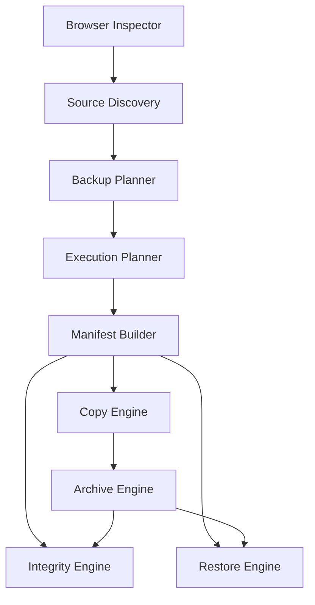

# Vue d’ensemble de l’architecture

FSBackup est organisé en modules spécialisés reliés par des contrats explicites. Chaque module conserve une responsabilité unique et expose ses fonctionnalités par la couche API lorsque nécessaire.

## Règles structurantes

- La couche API valide les entrées et délègue au service.
- Le service porte l’orchestration métier du module.
- Les modèles et schémas décrivent les données manipulées.
- Un module aval ne redécouvre pas les données déjà produites par un module amont.
- Les opérations de lecture, de planification, de copie, d’archivage, de contrôle et de restauration restent séparées.
- Les contrats existants sont enrichis de manière rétrocompatible plutôt que remplacés.

## Objectifs

Cette architecture vise la testabilité, la déterminisme des plans, la traçabilité des sauvegardes, la limitation des effets de bord et l’ajout progressif de nouvelles cibles de sauvegarde.
